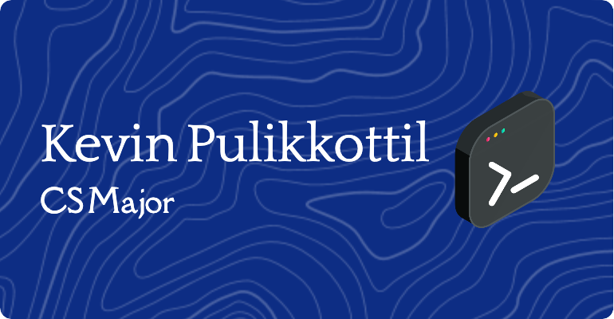

<!-- Dark Mode Banner Image -->

  

<h1 align="center" style="color: #ffffff;">Hi there, I'm Kevin Pulikkottil</h1>
<h3 align="center" style="color: #ffffff;">Computer Science Student | AI & Machine Learning Enthusiast</h3>

<!-- About Me Section -->

## About Me

I'm Kevin Pulikkottil, a Computer Science student at The University of Texas at Dallas (Class of 2026). I’m passionate about Cybersecurity, AI, machine learning, software development. I love tackling challenging problems - from building machine learning models for medical diagnostics to developing efficient software solutions.

- Currently working on AI research and software engineering projects.
- Continuously learning new technologies like TensorFlow, AWS, and more.
- Passionate about solving complex problems in algorithms, data structures, and AI.
- Feel free to ask me about my projects, cloud computing, or AI innovations.

<!-- Technical Skills -->

## Technical Skills

  
  
  
  
  
  
  
  
  

<!-- Project Highlights -->

## Project Highlights

- **Breast Cancer Detection Model:** Developed a machine learning model in Python (scikit-learn, pandas, NumPy) on the Breast Cancer Wisconsin Dataset, achieving 92% accuracy.
- **Handwritten Digit Recognition:** Built a CNN using TensorFlow and Keras to classify handwritten digits (MNIST Dataset) with 98% accuracy.
- **Diabetes Metrics Prediction:** Created a regression model in Python that improved predictive accuracy by 15% through feature engineering.
- **Text Summarization with NLP:** Developed a Transformer-based model achieving 90% coherence in text summaries.
- **YOLOv3 Fine-Tuning:** Enhanced object detection precision on a custom dataset for real-time applications.

<!-- GitHub Stats -->

## GitHub Stats

  
  

<!-- GitHub Trophies -->

## GitHub Trophies

  

  

<!-- Banner Image -->
