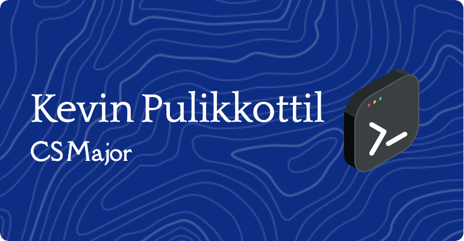

<!-- Dark Mode Banner Image -->

  

<h1 align="center">Hi, I'm Kevin Pulikkottil</h1>
<h3 align="center">Computer Science Student @ UT Dallas · Class of 2026</h3>
<h4 align="center">Security-Focused · Software Engineering · AI/ML</h4>

  
  
  

---

## About Me

I'm a senior CS student at UT Dallas with a focus on cybersecurity, software engineering, and AI/ML. Graduating May 2026.

- 🔐 Currently implementing **X25519/X448 ECDH key exchange inside a Trusted Execution Environment** on Arm64 QEMU for Toyota's TMNA Product Cybersecurity Group
- 🛡️ Active member of UT Dallas **Computer Security Group (CSG)** and **Cyber Defense and Response Unit (CDRU)**
- 🏠 Self-hosted homelab: Pi-hole DNS filtering, Tailscale VPN mesh, custom firewall configurations
- 📜 Pursuing **CompTIA Security+**
- 💼 Open to cybersecurity, DevSecOps, software engineering, and AI/ML roles

---

## Featured Projects

### 🔑 Toyota TMNA Capstone: TEE Cryptography *(In Progress)*

Implementing X25519 and X448 Elliptic Curve Diffie-Hellman key exchange within a Trusted Execution Environment for Toyota's Product Cybersecurity Group, targeting an Arm64 QEMU emulation environment.

`Cryptography` `ECDH` `ARM64` `QEMU` `TEE` `C/C++`

---

### 🔧 [ai-dev-utility](https://github.com/kpulik/ai-dev-utility)

Local-first AI developer toolkit that unifies The Agency, Impeccable, PromptFoo, and MiniFish into one setup flow and web dashboard.
Supports no-cost local workflows with Ollama, plus prompt evaluation and red-team testing for LLM applications.

`Python` `Shell` `Ollama` `PromptFoo` `LLM Evaluation` `Security Testing`

---

### 💬 [GroupUs - GroupMe Desktop Client](https://github.com/kpulik/GroupUs)

Unofficial cross-platform desktop client for GroupMe with OAuth sign-in, conversation filters, topic controls, and per-thread mute/read management.
Designed for fast messaging workflows with customizable themes and built-in update support.

`Desktop App` `OAuth` `API Integration` `Cross-Platform` `UX`

---

### 🧠 [VaultChat](https://github.com/kpulik/VaultChat)

Multi-provider AI chat plugin for Obsidian with support for Anthropic, OpenAI, Gemini, OpenRouter, and local Ollama models.
Includes vault-aware file read/edit/create/delete operations, streaming responses, and persistent searchable chat history.

`Obsidian` `TypeScript` `LLM` `Ollama` `Plugin Development` `Productivity`

---

### 🤖 [AI/ML Projects](https://github.com/kpulik/AI-Projects)

ML models for medical diagnostics and NLP tasks.

- Breast cancer detection: 92% accuracy (scikit-learn, pandas, NumPy)
- CNN digit recognition: 98% accuracy (TensorFlow, Keras)
- Transformer-based text summarization: 90% coherence score
- Diabetes prediction regression model with feature engineering
- YOLOv3 fine-tuning for real-time object detection

`Python` `TensorFlow` `Keras` `scikit-learn` `NumPy`

---

### 🚨 [Crowdsourced Disaster Relief System](https://github.com/ceenguyen05/CS3354Project)

Collaborative mobile app for real-time disaster coordination and resource tracking.

`Dart` `Flutter`

---

## Technical Skills

<!-- Languages -->

  
  
  
  
  
  
  

<!-- Security & Infra -->

  
  
  
  
  
  
  

<!-- AI/ML -->

  
  
  
  
  

---

## GitHub Stats

  
  

## GitHub Trophies

  

---

<strong>Support My Work</strong>

  

  

